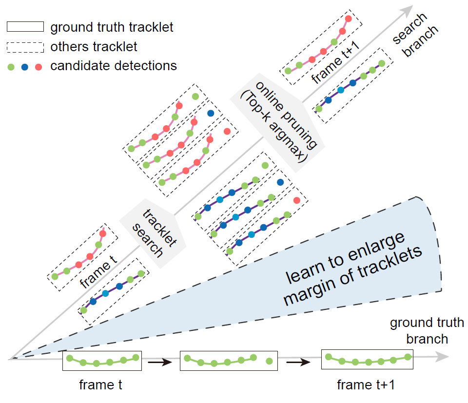

# Multi-object Tracking via End-to-end Tracklet Searching and Ranking

By [Tao Hu](https://ecart18.github.io/), [Lichao Huang](https://scholar.google.com/citations?user=F2e_jZMAAAAJ&hl=en), [Han Shen](han.shen@horizon.ai).

The code for the official implementation of paper **[TSR-tracker](doc/Multi-object Tracking via End-to-end Tracklet Searching and Ranking.pdf)**. 

## Contents
1. [Motivation](#motivation)
2. [Performances](#performance)
3. [Environment Setup](#environment-setup)
4. [Training & Inference](#train-inference)
5. [Acknowledgement](#acknowledgement)
6. [Bibtex](#bibtex)

## Motivation <a name="motivation">
<div align='center'><br></div>

## Performances <a name="performance">
#### Results

| Datasets  | Type        | MOTA &uarr;| MOTP &uarr;| FP &darr;| FN &darr;| IDF &uarr;| IDP &uarr;| IDR &uarr;| IDS &darr;| Frag &darr;| MT &uarr;| ML &darr;|
|:---------:|:-----------:|:----------:|:----------:|:--------:|:--------:|:---------:|:---------:|:---------:|:---------:|:----------:|:--------:|:--------:|
| 2DMOT15   | online      |     52.6   |    76.6    |  20,089  |  244,930 |    51.3   |    68.3   |    41.1   |   2,530   |   4,170    |   19.5   |   38.2   |
| 2DMOT15   | near-online |     52.6   |    76.6    |  20,089  |  244,930 |    51.3   |    68.3   |    41.1   |   2,530   |   4,170    |   19.5   |   38.2   |
| MOT16     | online      |     52.6   |    76.6    |  20,089  |  244,930 |    51.3   |    68.3   |    41.1   |   2,530   |   4,170    |   19.5   |   38.2   |
| MOT16     | near-online |     52.6   |    76.6    |  20,089  |  244,930 |    51.3   |    68.3   |    41.1   |   2,530   |   4,170    |   19.5   |   38.2   |
| MOT17     | online      |     52.6   |    76.6    |  20,089  |  244,930 |    51.3   |    68.3   |    41.1   |   2,530   |   4,170    |   19.5   |   38.2   |
| MOT17     | near-online |     53.3   |    76.5    |  22,161  |  238,959 |    53.3   |    70.0   |    43.1   |   2,434   |   4,089    |   20.0   |   38.7   | 

**Note:** 
- The results are better than reported in the paper because we modify some hyper-parameters.
- The results could be slightly different depending on the running environment.

#### Models
Trained models can be download in [Google Drive](https://drive.google.com/drive/). If you want to use it, please put the model in ./experiments/train_refiner/job_data and ./experiments/train_tracker/job_data respectively.


## Environment Setup <a name="environment-setup">

**Env Requirements:** 
- Linux.
- Python 3.5+.
- PyTorch 1.3 or higher.
- CUDA 9.0 or higher.
- NCCL 2 or higher if you want to use distributed training.


0. Download MOT dataset from [MOT challenge website](https://https://motchallenge.net/), e.g. [MOT17](https://motchallenge.net/data/MOT17/#download),  extract files and put it in the directory you defined. 

1. After the download, link your datasets to the current directory, like,
    ```
    cd data
    ln -s  your/path/to/data/2DMOT2015 ./2DMOT2015
    ln -s  your/path/to/data/MOT17 ./MOT17
    ```
2. Split training and validation set. For example, I use MOT17-09 as validation set, and others video as training set. 
    ```
    cd ./data
    mkdir val
    mkdir trainval
    mv train/MOT17-09-FRCNN val/
    ```
    The directory should have the following structure:
    ```
                data
                |-------MOT15
                |    |----train
                |         |---video_folder1
                |             |---det
                |             |---gt
                |             |---img1
                          |...
                |    |----val
                |         |---video_folder2
                |             |---det
                |             |---gt
                |             |---img1
                          |...
                |    |----test
                |         |---video_folder3
                |             |---det
                |             |---gt
                |             |---img1
                          |...
                ...
                |-------MOT17
                |    |
                ...
    ```
3. Download pre-train model for backbone, and put it in `./pretrainmodel`
    ```
    cd ./pretrainmodel
    wget  https://download.pytorch.org/models/resnet50-19c8e357.pth
    ```
4. Install others dependencies. Our environment is [PyTorch 1.3.0+cu92](https://pytorch.org/get-started/previous-versions/), [torchvision 0.4.1+cu92](https://pytorch.org/get-started/previous-versions/).
    ```
    pip install -r requirements.txt
    ```

## Training & Inference <a name="train-inference">

#### train refiner model:
```
#  Multi GPUs (e.g. 4 GPUs)
cd ./experiments/train_tsr
CUDA_VISIBLE_DEVICES=0,1,2,3 python ../../scripts/train_refiner.py --cfg config.yaml
```

#### train tracker model:
```
#  Multi GPUs (e.g. 4 GPUs)
cd ./experiments/train_tsr
CUDA_VISIBLE_DEVICES=0,1,2,3 python ../../scripts/train_tsr.py --cfg config.yaml
```

#### inference for online version:
```
cd ./experiments/test_tsr
python ../../scripts/test_MOT17.py --cfg config.yaml
```

#### inference for near-online version:
```
cd ./experiments/test_tsr
python ../../scripts/test_MOT17.py --cfg config.yaml
```

## Acknowledgement<a name="acknowledgement">

The work was mainly done during an internship at [Horizon Robotics](http://horizon.ai/).

## Bibtex<a name="bibtex">
Please consider citing our paper in your publications if the project helps your research. BibTeX reference is as follows.

```
@article{hu2020multi,
  title={Multi-object Tracking via End-to-end Tracklet Searching and Ranking},
  author={Hu, Tao and Huang, Lichao and Shen, Han},
  journal={arXiv preprint arXiv:2003.02795},
  year={2020}
}
```

## License
For academic use, this project is licensed under the 2-clause BSD License - see the LICENSE file for details. For commercial use, please contact the authors. 